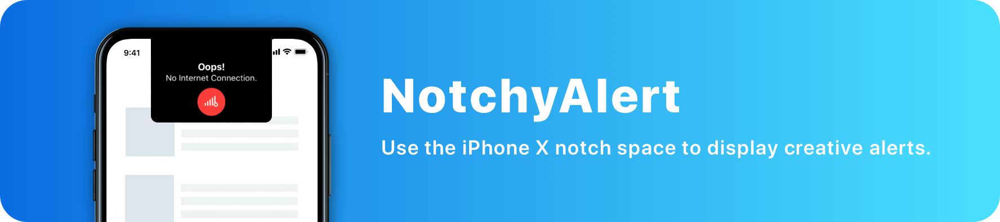
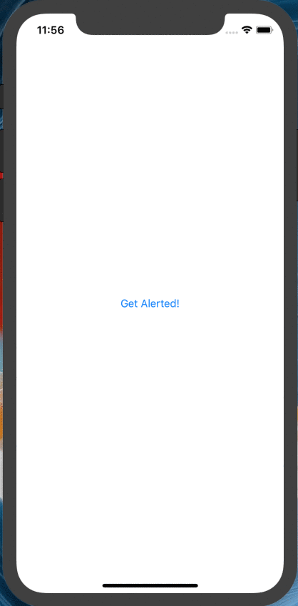

# NotchyAlert
[](http://cocoapods.org)
[](https://github.com/Carthage/Carthage)
[](https://developer.apple.com/)
[](https://github.com/TheAbstractDev/NotchyAlert/blob/master/LICENSE)



## Prerequisites
- Xcode 9.x
- Swift 4.x
- iPhone X Simulator/Device

## Demo





## Installation

### Cocoapods
To install NotchyAlert using [Cocoapods](http://cocoapods.org), add the following line to your Podfile:

```
pod 'NotchyAlert'
```

### Carthage
To install NotchyAlert using [Carthage](https://github.com/Carthage/Carthage), add the following line to your Cartfile:

```
github "TheAbstractDev/NotchyAlert"
```

## Usage
First, you'll need to import NotchyAlert

```swift
import NotchyAlert
```

#### Title Only

```swift
let notchy = Notchy(title: "Oops!", description: nil, image: nil)
notchy.presentNotchy(in: self.view, duration: 3)
```

#### Title and Description

```swift
let notchy = Notchy(title: "Oops!", description: "No Internet Connection.", image: nil)
notchy.presentNotchy(in: self.view, duration: 3)
```

#### Title and Image

```swift
let notchy = Notchy(title: "Oops!", description: nil, image: "<YOUR IMAGE>)
notchy.presentNotchy(in: self.view, duration: 3)
```

#### Title, Decription and Image

```swift
let notchy = Notchy(title: "Oops!", description: "No Internet Connection.", image: "<YOUR IMAGE>)
notchy.presentNotchy(in: self.view, duration: 3)
```

### Bounce Effect
By default, the bounce effect is true.
You can choose to disable the bounce effect by setting false on the call of `presentNotchy`
```swift
notchy.presentNotchy(in: self.view, duration: 3, bounce: false)
```

## Example
You can test it by downloading and run the Example project.


## License
NotchyAlert is available under the MIT license. See the LICENSE file for more info.
