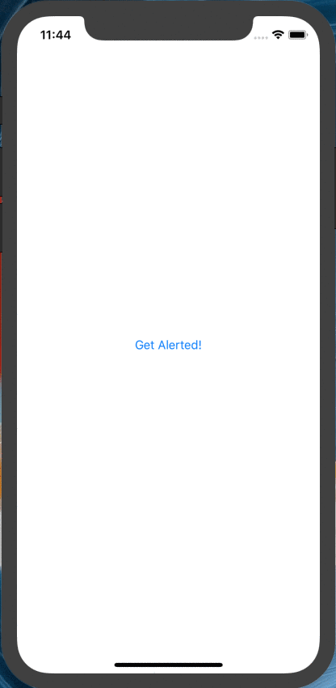
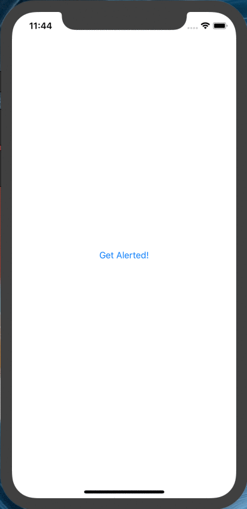
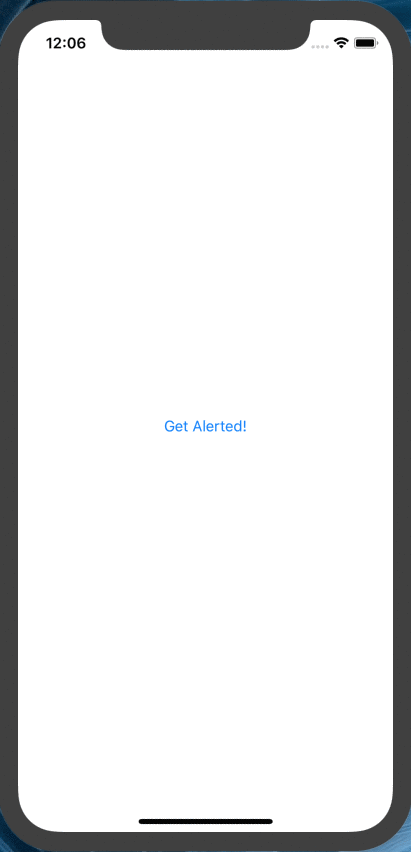

# NotchyAlert
[](https://github.com/Carthage/Carthage)






## Installation

### Carthage

To install NotchyAlert using [Carthage](https://github.com/Carthage/Carthage), add the following line to your Cartfile:

```
github "TheAbstractDev/NotchyAlert"
```

### Presentation

#### Title Only

```swift
let notchy = Notchy(title: "Oops!", description: nil, image: nil)
notchy.presentNotchy(in: self.view, duration: 3)
```

#### Title and Description

```swift
let notchy = Notchy(title: "Oops!", description: "No Internet Connection.", image: nil)
notchy.presentNotchy(in: self.view, duration: 3)
```

#### Image Only

```swift
let notchy = Notchy(title: "Oops!", description: nil, image: "<YOUR IMAGE>)
notchy.presentNotchy(in: self.view, duration: 3)
```

#### Image and Decription

```swift
let notchy = Notchy(title: "Oops!", description: "No Internet Connection.", image: "<YOUR IMAGE>)
notchy.presentNotchy(in: self.view, duration: 3)
```

## Example
You can test it by downloading the project.
